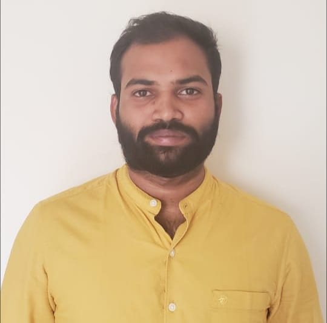

## Bokkisam Srinadh
I am from India. I have completed by Bachelors from ***Vellore Institute of Technology***. I have worked as an **UI developer** for the past 2.8 years in Thinkbridge. I have Hands-on experience in JavaScript, TypeScript.I am an University cricket team player and also a state level chess player.
******

******

## My Favourite sports:
Playing sports helps you stay in shape, teaches you how to organize your time, boosts friendships, and builds relationships with your peers and adults. Through athletics, you gain skills that can best be acquired on a court, track, or field.

|NAME|REASON TO PLAY|HOURS|
|----|--------------|-----|
|CRICKET|INCREASES PHYSICAL FITNESS AND DEVELOP TEAMWORK SKILLS|4 hrs|
|KABADDI|SHARP MOVES AND INCREASES STAMINA & PATIENCE|2 hrs|
|BADMINTON|INCREASES CONCENTRATION AND ADJUSTEMTNS AS PER THE SITUATION|2 hrs|
|CHESS|DEVELOP LOGICAL THINKING AND PLANNING FOR DUFFERENT SITUATIONS|4 hrs|
